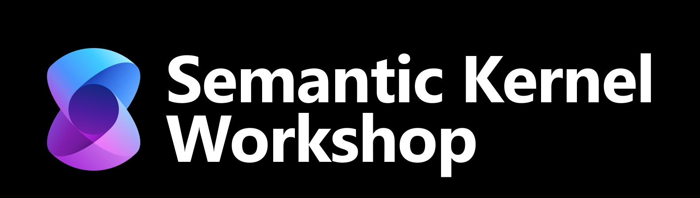
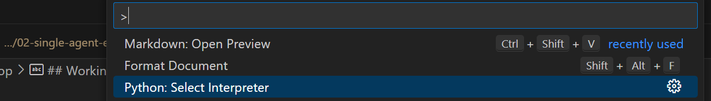

<p align="center">
  
</p>

# 🤖 Agents Workshop

Welcome to the **Agents Workshop**! This hands-on guide will help you understand, build, and extend AI agents using the latest Azure and Semantic Kernel technologies.

---

## 🚀 What Are AI Agents?

AI Agents are autonomous programs that can reason, plan, and act to accomplish tasks. They:
- Use large language models (LLMs) to understand instructions and context
- Can call tools (APIs, code, plugins) to gather information or take actions
- Maintain memory and context across conversations
- Are extensible with custom skills and tools

**In this workshop, you'll learn how to:**
- Build and run your own AI agents
- Connect agents to external APIs and tools
- Extend agents with custom logic

---

## Workshop Agenda

1. **Introduction to Agentic AI**
   - Overview of agentic AI and its applications
   - High-level introduction to the Azure AI agent service
   - Evolution from chatbots to agentic workflows

2. **Single Agent Example**
   - Walkthrough of creating an agent using the Python SDK
   - Agents key components and architecture
   - Configuring agent behaviors and capabilities

   Go to 👉[README.md](./agents-workshop/02-single-agent-example/README.md).

3. **Building Custom Tools**
   - Understanding Tool Calling with Azure OpenAI models
   - Introduction to built-in tools and integrations (e.g., AI search, Bing grounding)
   - Creating Semantic Kernel plugins for agent extensibility
   - Integrating external services with OpenAPI specifications
   - **Stretch goal** - Configure authentication for tools using On-Behalf-Of (OBO) flow
   - **Stretch goal** - Create complex custom tools for specific services like Stack Overflow or Azure DevOps

   Go to 👉[README.md](./agents-workshop/03-building-custom-tools/README.md).

4. **Multi-Agent Workflows**
   - Agent as Tool
   - Example of a router agent for question routing
   - Upcoming orchestration capabilities in Azure AI agent service

   Go to 👉[README.md](./agents-workshop/04-multi-agent-workflows/README.md).

5. **Wrap-Up and Next Steps**
   - Summarize key learnings and takeaways
   - Discuss potential applications and future workshops

---

## Prerequisites

WSL2 is the recommended deployment environment and local development.


### 🛠️ Tools

- [Azure CLI](https://learn.microsoft.com/en-us/cli/azure/install-azure-cli?view=azure-cli-latest)
- [Azure Developer CLI](https://learn.microsoft.com/en-us/azure/developer/azure-developer-cli/install-azd?tabs=winget-windows%2Cbrew-mac%2Cscript-linux&pivots=os-windows)
- [UV](https://docs.astral.sh/uv/getting-started/installation/) (for Python version and package management)
  - Example: `uv python install 3.12`
- Python 3.12
- Python 3.13 for Gradio App
- [Optional] [VSCode](https://code.visualstudio.com/download)
- [Optional] Docker - required when deploying Azure Container Apps (when not available, service deployment has to be commented out in [azure.yaml](./azure.yaml))

### Azure

- Azure Subscription with **User Access Management** and **Contributor** permissions
- Permission to register applications in Entra ID (for on-behalf-of scenarios)
- On-behalf-of requirement - permission to register applications in Entra Id.
---

## Deployment

Use Azure Developer Tools to deploy the "mini" landing zone with required resources.

```bash
azd up
```

This will provision all necessary Azure resources:


To share resources, assign users the `Azure AI User` role to enable access to AI Foundry.

> **Important:** By default, `azd` deployment configures firewalls to allow only the deployer's IP. To share resources, adjust firewall settings as needed.

### Deploying with Contributor-Only Permissions

To deploy with minimal permissions:

1. Create an azd environment:
   ```bash
   azd env new
   ```
2. Set azd variables:
   ```bash
   azd env set ADD_ROLE_ASSIGNMENTS False
   azd env set ADD_APP_REGISTRATION False
   ```

  If private link is not enabled, disable private link for search using `ADD_PRIVATE_LINK_FOR_SEARCH` flag
   ```bash
   azd env set ADD_PRIVATE_LINK_FOR_SEARCH False
   ```
4. Deploy with `azd up`
5. Manually assign the following roles to the manged identity in the resource group:
   - `Keyvault Secret Officer` on KeyVault
   - `Keyvault Contributor` on KeyVault
   - `ACR Pull Role` on Azure Container Registry
   - `Blob Data Contributor` on Storage Account
   - `Cognitive Services OpenAI Contributor` on Cognitive Services account
   - `Cognitive Services User` on Cognitive Services account
   - `Cognitive Services OpenAI User` on Cognitive Services account
   - `Cognitive Services Contributor` on Cognitive Services account
   - `Index Data Contributor` on AI Search
   - `Index Data Reader` on AI Search
   - `Search Service Contributor` on AI Search
   - `Azure Maps Data Reader` on Maps

   > Roles can be assigned on the Resource Group level.

   <details>
  <summary>Azure CLI Bash script for permissions</summary>
    ```bash
    set -e

    RG_NAME="$1"
    IDENTITY_NAME="$2"

    if [[ -z "$RG_NAME" || -z "$IDENTITY_NAME" ]]; then
      echo "Usage: $0 <resource-group> <identity-name>"
      exit 1
    fi

    ##### Get the managed identity principalId
    IDENTITY_PRINCIPAL_ID=$(az identity show -g "$RG_NAME" -n "$IDENTITY_NAME" --query 'principalId' -o tsv)

    ##### Role definitions
    declare -A ROLES=(
      ["Key Vault Secrets Officer"]="b86a8fe4-44ce-4948-aee5-eccb2c155cd7"
      ["Key Vault Contributor"]="f25e0fa2-a7c8-4377-a976-54943a77a395"
      ["AcrPull"]="7f951dda-4ed3-4680-a7ca-43fe172d538d"
      ["Storage Blob Data Contributor"]="ba92f5b4-2d11-453d-a403-e96b0029c9fe"
      ["Cognitive Services OpenAI Contributor"]="e2d1a6a3-7f7b-4c3b-8b2b-1a1b6b7c7c74"
      ["Cognitive Services User"]="b1e7c3c0-8070-4c0f-9a3e-5c1e1d6a7c6e"
      ["Cognitive Services OpenAI User"]="bbed9e0c-87a6-4b4c-8c5c-1a1b6b7c7c74"
      ["Cognitive Services Contributor"]="a97b65f3-24c7-4388-8c0a-4a2a2b1c5c0e"
      ["Search Index Data Contributor"]="5984c3c4-9d3c-4b66-a7b1-3f7f7f7f7f7f"
      ["Search Index Data Reader"]="b1e7c3c0-8070-4c0f-9a3e-5c1e1d6a7c6e"
      ["Search Service Contributor"]="de139f84-1756-47ae-9be6-808fbbe84772"
      ["Azure Maps Data Reader"]="e4e6a7c1-8c8b-4c8b-8c8b-8c8b8c8b8c8b"
    )

    ##### Assign roles
    for ROLE_NAME in "${!ROLES[@]}"; do
      ROLE_ID="${ROLES[$ROLE_NAME]}"
      echo "Assigning '$ROLE_NAME' ($ROLE_ID) to $IDENTITY_NAME on resource group $RG_NAME..."
      az role assignment create \
        --assignee-object-id "$IDENTITY_PRINCIPAL_ID" \
        --role "$ROLE_ID" \
        --resource-group "$RG_NAME"
    done

    echo "All roles assigned."
    ```
</details>
6. Re-deploy with `azd up`

---

## Working on Workshop Tasks

Each workshop task uses `uv` for Python version and package management.

1. Navigate to the task directory, e.g.:
   ```bash
   cd agents-workshop/02-single-agent-example/azure-ai-agent
   ```
2. Follow the instructions in the `README.md` within each subfolder.

### Setting up `uv` and VS Code

Each directory is setup with it's own uv environment. To activate:

1. Run `uv sync`
2. Change VS Code Python interpreter using "Ctrl+Shift+P" and selecting `Python: Select Interpreter`. Choose one just activated by navigating to `<task directory>/.venv/lib/python3.12/` (or python 3.13 for gradio).

    <p align="left">
      
    </p>


> **💡 Tip** When experiencing issues with python packages, try opening VS Code in the directory of the task.

---

## 🧑‍💻 How to Get Started

1. Clone this repo and set up your environment (see `scripts/` for setup scripts).
2. Explore the `agents-workshop/` folders for guided examples and exercises.
3. Use the provided code samples as a starting point for your own agents.

---

## 💡 Tips

- Use the provided `.env` and setup scripts to configure your environment.
- Check the `README.md` in each subfolder for specific instructions.
- Experiment! Try connecting your agent to other APIs or tools.

---

## Other Materials

- [Hackathon from MS Learn](https://learn.microsoft.com/en-us/semantic-kernel/support/hackathon-materials)
- [🔥 MS Build 2025 - Build your code-first agent with Azure AI Foundry Workshop](https://microsoft.github.io/build-your-first-agent-with-azure-ai-agent-service-workshop/)

Happy hacking! 🤖✨