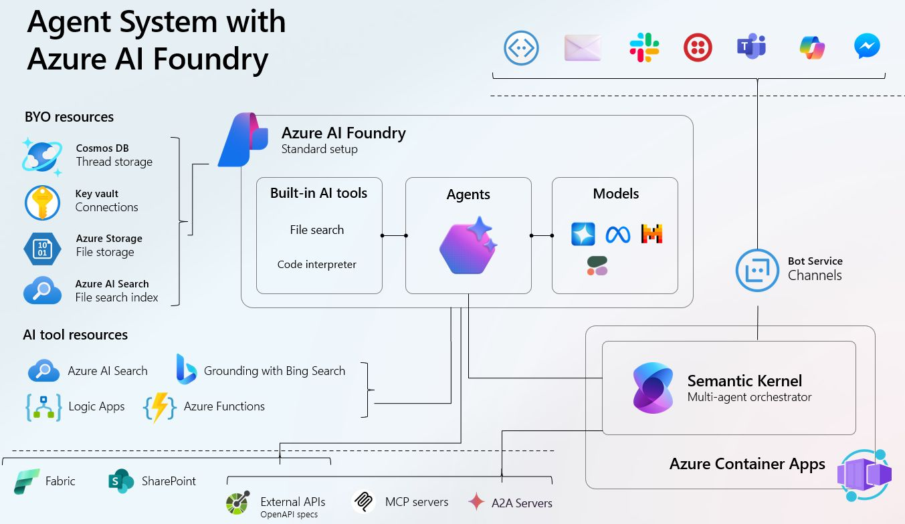

<p align="center">
  
</p>

# 🤖 Agents Workshop

Welcome to the **Agents Workshop**! This hands-on guide will help you understand, build, and extend AI agents using the latest Azure and Semantic Kernel technologies.

---

## 🚀 What Are AI Agents?

AI Agents are autonomous programs that can reason, plan, and act to accomplish tasks. They:
- Use large language models (LLMs) to understand instructions and context
- Can call tools (APIs, code, plugins) to gather information or take actions
- Maintain memory and context across conversations
- Are extensible with custom skills and tools

**In this workshop, you'll learn how to:**
- Build and run your own AI agents
- Connect agents to external APIs and tools
- Extend agents with custom logic

---

## Workshop Agenda

1. **Introduction to Agentic AI**
   - Overview of agentic AI and its applications
   - High-level introduction to the Azure AI agent service
   - Evolution from chatbots to agentic workflows

2. **Single Agent Example**
   - Walkthrough of creating an agent using the Python SDK
   - Introduction to built-in tools and integrations (e.g., AI search, Bing grounding)

3. **Building Custom Tools**
   - Build a custom tool for Stack Overflow or Azure DevOps
   - Discuss the on-behalf-of (OBO) authentication workflow

4. **Multi-Agent Workflows**
   - Introduction to Semantic Kernel and its applications
   - Example of a router agent for question routing
   - Upcoming orchestration capabilities in Azure AI agent service

5. **Wrap-Up and Next Steps**
   - Summarize key learnings and takeaways
   - Discuss potential applications and future workshops

---

## Prerequisites

### Tools

- [Azure CLI](https://learn.microsoft.com/en-us/cli/azure/install-azure-cli?view=azure-cli-latest)
- [Azure Developer CLI](https://learn.microsoft.com/en-us/azure/developer/azure-developer-cli/install-azd?tabs=winget-windows%2Cbrew-mac%2Cscript-linux&pivots=os-windows)
- [UV](https://docs.astral.sh/uv/getting-started/installation/) (for Python version and package management)
  - Example: `uv python install 3.12`
- Python 3.12
- [Optional] [VSCode](https://code.visualstudio.com/download)

### Azure

- Azure Subscription with **User Access Management** and **Contributor** permissions
- Permission to register applications in Entra ID (for on-behalf-of scenarios)
- On-behalf-of requirement - permission to register applications in Entra Id.
---

## Deployment

Use Azure Developer Tools to deploy the "mini" landing zone with required resources.

```bash
azd up
```

This will provision all necessary Azure resources:



To share resources, assign users the `Azure AI User` role to enable access to AI Foundry.

> **Important:** By default, `azd` deployment configures firewalls to allow only the deployer's IP. To share resources, adjust firewall settings as needed.

### Deploying with Contributor-Only Permissions

To deploy with minimal permissions:

1. Create an azd environment:
   ```bash
   azd env new
   ```
2. Set azd variables:
   ```bash
   azd env set ADD_ROLE_ASSIGNMENTS False
   azd env set ADD_APP_REGISTRATION False
   ```
3. Manually assign the following roles to the user-assigned identity:
   - `Keyvault Secret Officer` on KeyVault
   - `Keyvault Contributor` on KeyVault
   - `ACR Pull Role` on Azure Container Registry
   - `Blob Data Contributor` on Storage Account
   - `Cognitive Services OpenAI Contributor` on Cognitive Services account
   - `Cognitive Services User` on Cognitive Services account
   - `Cognitive Services OpenAI User` on Cognitive Services account
   - `Cognitive Services Contributor` on Cognitive Services account
   - `Index Data Contributor` on AI Search
   - `Index Data Reader` on AI Search
   - `Search Service Contributor` on AI Search
   - `Azure Maps Data Reader` on Maps

---

## Working on Workshop Tasks

Each workshop task uses `uv` for Python version and package management.

1. Navigate to the task directory, e.g.:
   ```bash
   cd agents-workshop/02-single-agent-example/azure-ai-agent
   ```
2. Follow the instructions in the `README.md` within each subfolder.

---

## Materials

- [Hackathon from MS Learn](https://learn.microsoft.com/en-us/semantic-kernel/support/hackathon-materials)
- [🔥 MS Build 2025 - Build your code-first agent with Azure AI Foundry Workshop](https://microsoft.github.io/build-your-first-agent-with-azure-ai-agent-service-workshop/)

---

## 🧑‍💻 How to Get Started

1. Clone this repo and set up your environment (see `scripts/` for setup scripts).
2. Explore the `agents-workshop/` folders for guided examples and exercises.
3. Use the provided code samples as a starting point for your own agents.

---

## 💡 Tips

- Use the provided `.env` and setup scripts to configure your environment.
- Check the `README.md` in each subfolder for specific instructions.
- Experiment! Try connecting your agent to other APIs or tools.

---

Happy hacking! 🤖✨